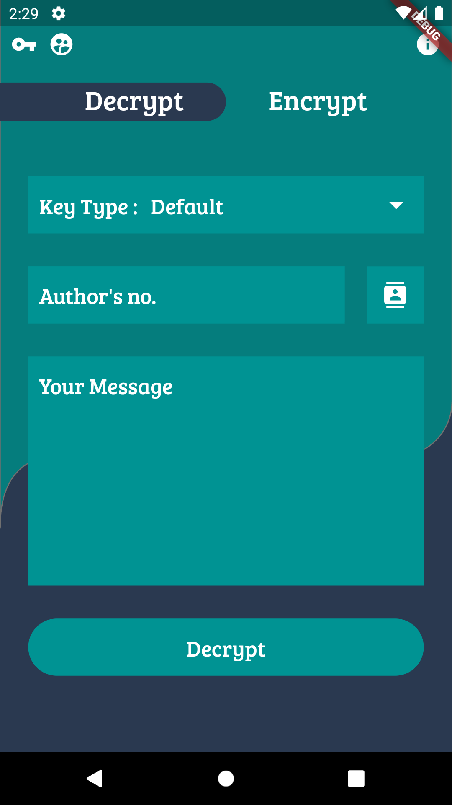

# Dots & Dashes
 
Ever faced security concerns while sending a personal message like maybe a pin. No worries we got u covered Dots and dashes encrypts your secret using AES algorithm which by the way is most trusted encryption algorithm as of now.  
Made with 

## How to use 
### Encryption
Just enter your message then enter the phone number of the intended receiver and encrypt your message into bunch of Dots & dashes.  
Send these dots and dashes to the receiver... No no they are no morse code and no computer can decrypt it except the intended user.  
### Decryption
Then while decrypting just paste those Dots & dashes then select the senders number and decrypt!'  
### Screenshots

